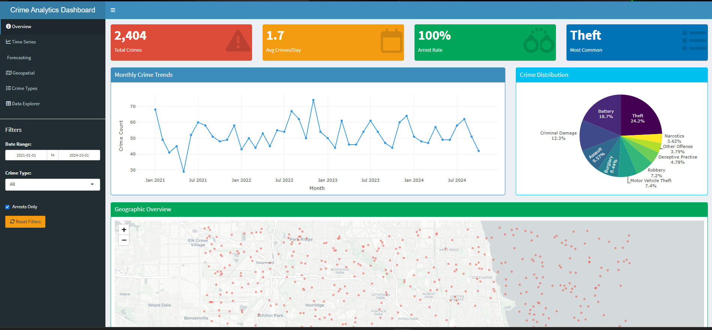
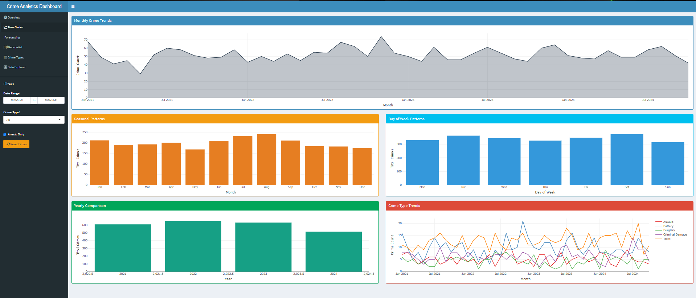
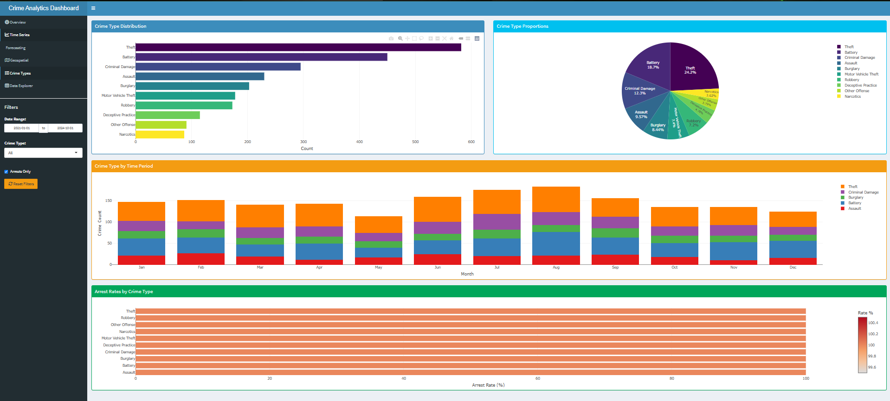

# Crime Data Analytics & Prediction Project

**A comprehensive time-series and geospatial analysis of crime data using R**

Check it out at https://bog67.shinyapps.io/crime-analytics-dashboard/ 

## 📊 Project Overview

This project analyzes and forecasts crime trends using real-world police crime datasets (Chicago Crimes Data, Madison PD reports, etc.). It combines time-series forecasting, geospatial visualization, and interactive dashboards to provide actionable insights into crime patterns.

## 🎯 Key Features

- **Data Import & Cleaning**: Automated pipeline using `tidyverse` and `janitor`
- **Time-Series Analysis**: Trend detection and seasonal patterns with `lubridate` and `tsibble`
- **Crime Forecasting**: ARIMA and Prophet models for 6-month predictions
- **Geospatial Heatmaps**: Interactive crime hotspot maps using `ggmap` and `leaflet`
- **Interactive Dashboard**: Comprehensive Shiny dashboard for visualization

## � Screenshots

### Dashboard Overview


### Time-Series Analysis


### Geospatial Visualization


## �📈 Key Outputs

✅ Crime hotspots by location  
✅ Monthly/seasonal crime patterns  
✅ Crime forecast for next 6 months  
✅ Interactive crime dashboard  

## Skills Demonstrated

- Data cleaning and preprocessing
- R data wrangling & feature engineering
- Time-series forecasting (ARIMA, Prophet)
- Geospatial visualization
- Interactive dashboard development
- Shiny dashboard development
- Statistical modeling

## 📁 Project Structure

```
Crime report/
│
├── data/                  # Raw and cleaned datasets
│   ├── raw/              # Original crime data
│   └── processed/        # Cleaned data
│
├── scripts/              # R analysis scripts
│   ├── 01_data_import.R          # Data loading and cleaning
│   ├── 02_time_series_analysis.R # Temporal analysis
│   ├── 03_forecasting.R          # ARIMA & Prophet models
│   ├── 04_geospatial.R           # Maps and heatmaps
│   └── 00_install_packages.R    # Package installation
│
├── outputs/              # Generated visualizations
│   ├── plots/           # Time-series charts
│   └── maps/            # Geospatial visualizations
│
├── dashboard/           # Shiny application
│   ├── app.R           # Main dashboard
│   └── ui.R            # UI components (if separated)
│
└── README.md           # This file
```

## 📦 Required Packages

Install all required packages by running:

```r
source("scripts/00_install_packages.R")
```

### Core Packages:
- `tidyverse` - Data manipulation and visualization
- `janitor` - Data cleaning
- `lubridate` - Date/time handling
- `tsibble` - Time-series data structures
- `forecast` - ARIMA modeling
- `prophet` - Facebook's forecasting tool
- `ggmap` - Static maps
- `leaflet` - Interactive maps
- `shiny` - Interactive dashboard
- `flexdashboard` - Dashboard layout
- `sf` - Spatial data handling
- `viridis` - Color palettes

## 📊 Analysis Workflow

### Step 1: Data Import & Cleaning
- Load crime datasets
- Clean column names
- Handle missing values
- Standardize date formats
- Filter relevant crime types

### Step 2: Time-Series Analysis
- Aggregate crimes by time period
- Detect trends and seasonality
- Create time-series visualizations
- Identify peak crime periods

### Step 3: Forecasting
- Prepare time-series data
- Build ARIMA model
- Build Prophet model
- Compare model performance
- Generate 6-month forecasts

### Step 4: Geospatial Analysis
- Clean location data
- Create crime density maps
- Identify hotspots
- Generate interactive leaflet maps

### Step 5: Dashboard
- Integrate all visualizations
- Add interactive filters
- Display key metrics
- Enable data exploration

## 📈 Sample Outputs

### Time-Series Forecast
- Monthly crime trends
- Seasonal decomposition
- 6-month ARIMA predictions
- Prophet forecast with confidence intervals

### Geospatial Maps
- Crime hotspot heatmaps
- Location-based clustering
- Interactive marker maps
- Density overlays

### Dashboard Features
- Date range selector
- Crime type filter
- Location filter
- Download reports

## 🔍 Key Insights

After running the analysis, you'll discover:

1. **Temporal Patterns**: When crimes peak (time of day, day of week, season)
2. **Geographic Hotspots**: High-crime areas requiring attention
3. **Crime Categories**: Most common crime types
4. **Trends**: Whether crime is increasing or decreasing
5. **Forecasts**: Expected crime levels for the next 6 months

## 📝 Notes

- **Data Privacy**: Ensure compliance with data usage policies
- **API Keys**: Google Maps API key required for `ggmap` (or use OpenStreetMap)
- **Performance**: Large datasets may require data sampling for faster processing
- **Updates**: Crime data is typically updated monthly


